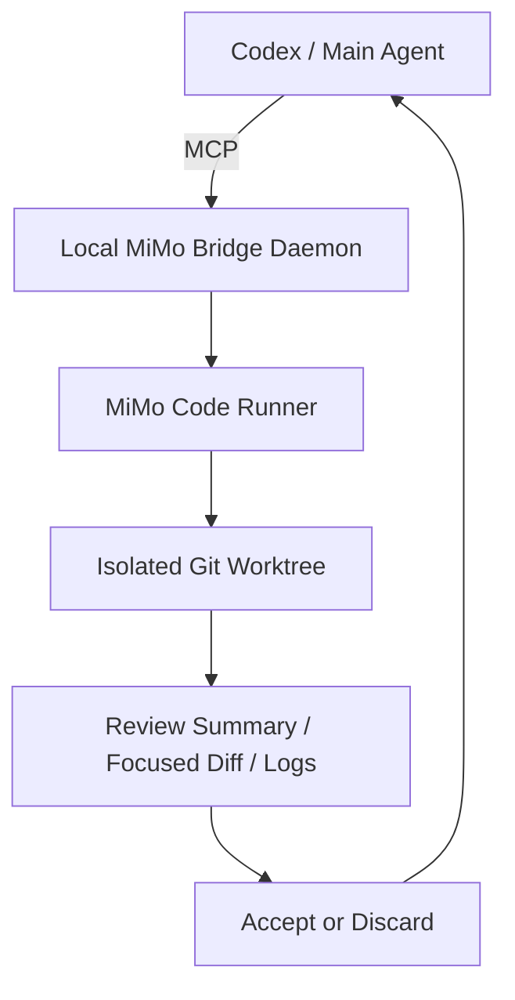
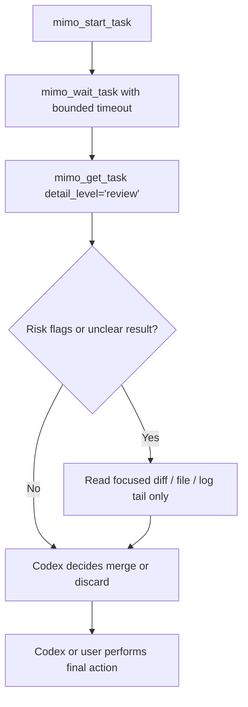

# MiMo Bridge MCP

Let Codex delegate bounded coding tasks to MiMo Code through MCP.

**Codex plans and reviews; MiMo Code executes isolated coding tasks inside Git Worktrees.**

一个让 Codex 通过 MCP 调度 MiMo Code 执行编码任务的本地桥接服务：Codex 负责规划和审核，MiMo Code 负责在独立 Git Worktree 中完成具体修改。

## Why This Exists

Codex is strong at planning, architectural judgment, and code review. It can also write code, but long coding loops can burn a lot of output tokens and make review harder to keep focused.

MiMo Code is better used as a bounded executor: it receives a constrained task, works inside an isolated Git Worktree, and returns a review-oriented result. MiMo Bridge MCP connects the two through a localhost-only MCP daemon so the stronger model stays in control of planning, risk review, and final acceptance.

## How It Works



## Core Benefits

- **Low-token workflow:** Codex no longer needs to emit large volumes of code; it plans, constrains, and reviews.
- **Bounded tasks:** MiMo Code receives scoped work instead of permission to wander through the whole repository.
- **Git Worktree isolation:** Each task runs in its own Worktree to reduce main-branch contamination risk.
- **Review-first:** Codex reads summaries, focused diffs, and risk flags before deciding whether to merge.
- **Localhost-only daemon:** The bridge runs locally and is not designed for public network exposure.
- **Windows-first:** The current release target is Windows 10/11 x64.
- **Admin UI:** The local daemon also serves a browser-based management UI.
- **Portable ZIP / EXE installer:** Windows packaging is designed to lower the setup barrier for non-specialist users.

## Current Status

- Target OS: Windows 10/11 x64.
- Runtime: localhost-only Node daemon at `http://127.0.0.1:3210`.
- MCP endpoint: `http://127.0.0.1:3210/mcp`.
- Admin UI: served by the same daemon at `http://127.0.0.1:3210/`.
- Distribution: portable ZIP and EXE installer with bundled Node.
- MiMo Code must be installed and logged in separately on each machine.
- Release maturity: early alpha; clean Windows validation and community testing are still needed.

## Quick Start

### Prerequisites

- Windows 10/11 x64.
- MiMo Code installed and logged in.
- Git installed and available from PowerShell.
- Codex or another MCP-capable main agent.
- Node.js for source checkout development, or the bundled Node runtime when using packaged builds.

### Run Local Daemon

From the repository root:

```powershell
powershell -ExecutionPolicy Bypass -File apps/local-daemon/start-local.ps1
```

### Launcher Controls

```powershell
powershell -ExecutionPolicy Bypass -File apps/local-daemon/launcher.ps1 status
powershell -ExecutionPolicy Bypass -File apps/local-daemon/launcher.ps1 start -Open
powershell -ExecutionPolicy Bypass -File apps/local-daemon/launcher.ps1 stop
powershell -ExecutionPolicy Bypass -File apps/local-daemon/launcher.ps1 restart -Open
powershell -ExecutionPolicy Bypass -File apps/local-daemon/launcher.ps1 logs
```

### Connect Codex

Point Codex MCP configuration at:

```text
http://127.0.0.1:3210/mcp
```

Open the local Admin UI at:

```text
http://127.0.0.1:3210/
```

### First Task Flow

1. Codex starts a MiMo task with a clear scope and allowed paths.
2. Codex waits for the task with one bounded timeout.
3. Codex reads the review-level result first.
4. Codex escalates only to focused diff, file, or log reads when needed.
5. Codex accepts or discards the task Worktree.

## Low-Token Review Workflow

The bridge is designed around a review package, not a full-repository dump. Codex should inspect the smallest useful result first, then escalate only when the risk justifies it.



| Step | Tool / action | Token discipline |
| --- | --- | --- |
| 1 | `mimo_start_task` or equivalent | Send a bounded task with explicit allowed paths. |
| 2 | `mimo_wait_task` | Wait once with a reasonable timeout instead of polling repeatedly. |
| 3 | `mimo_get_task(detail_level="review")` | Read the review summary, changed files, risk flags, and diff stat first. |
| 4 | Focused escalation | Read only the relevant diff paths, files, or log tail if risk flags require it. |
| 5 | Final review | Codex decides whether to merge or discard the Worktree. |
| 6 | Merge boundary | MiMo Code must not merge its own Worktree. |

Avoid these shortcuts:

- Do not read the whole repository for convenience.
- Do not read full logs when a tail or specific failure section is enough.
- Do not read complete diffs unless the task is small and the full diff is genuinely useful.
- Do not let MiMo Code merge its own Worktree.
- Keep Codex as the final reviewer and decision maker.

## Build And Test References

Build commands:

```powershell
npm.cmd run build
cd apps/admin-ui; npm.cmd run build; cd ../..
cd apps/local-daemon; npm.cmd run build; cd ../..
```

Normal regression excludes the known hanging runner integration test:

```powershell
$tests = Get-ChildItem -LiteralPath 'tests' -Filter '*.test.mjs' |
  Where-Object { $_.Name -ne 'runner-integration.test.mjs' } |
  ForEach-Object { $_.FullName }
node --test $tests
```

Focused release checks:

```powershell
node --test tests/release-validation.test.mjs tests/installer-package.test.mjs tests/launcher-controller.test.mjs
npm.cmd run validate:release
```

## Package

```powershell
npm.cmd run package:portable
npm.cmd run package:installer
```

Generated release outputs are ignored by Git under `artifacts/`:

- `artifacts/MiMoBridge-portable-win10-win11-x64.zip`
- `artifacts/MiMoBridgeSetup-win10-win11-x64.exe`
- `artifacts/release-validation.json`

## Documentation

- [中文 README](README_zh-CN.md)
- [Troubleshooting](docs/TROUBLESHOOTING.md)
- [Good First Issues](docs/GOOD_FIRST_ISSUES.md)
- [GitHub Publication Checklist](docs/GITHUB_PUBLICATION_CHECKLIST.md)
- [Release Notes v0.1.0-alpha](docs/RELEASE_NOTES_v0.1.0-alpha.md)
- [Demo Script](docs/DEMO_SCRIPT.md)

Project handover and maintenance docs:

1. `PROJECT_MEMORY.md` - long-term project memory and current release state.
2. `AGENTS.md` - agent rules, collaboration workflow, and commands.
3. `docs/HANDOVER_STATUS.md` - short current handover summary.
4. `docs/OPEN_TASKS.md` - pending work and risks.
5. `docs/RELEASE_VALIDATION.md` - clean Windows validation checklist.
6. `docs/modules/windows-launcher-portability.md` - launcher, portable, and installer details.

## Contributing

Contributions are welcome, especially clean Windows testing, MCP configuration examples, troubleshooting improvements, Admin UI polish, and release validation reports.

Start with [CONTRIBUTING.md](CONTRIBUTING.md), [docs/GOOD_FIRST_ISSUES.md](docs/GOOD_FIRST_ISSUES.md), and [SECURITY.md](SECURITY.md). Please do not include API keys, full logs with private paths, MiMo credentials, tokens, or personal environment details in issues or pull requests.

## License

MIT. See [LICENSE](LICENSE).
