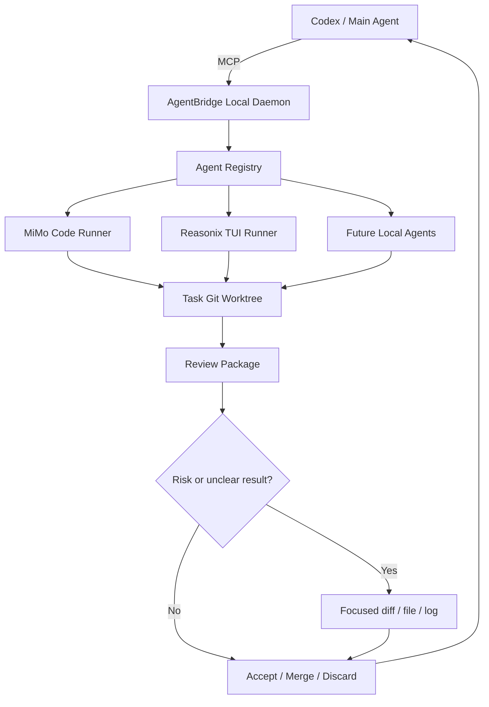
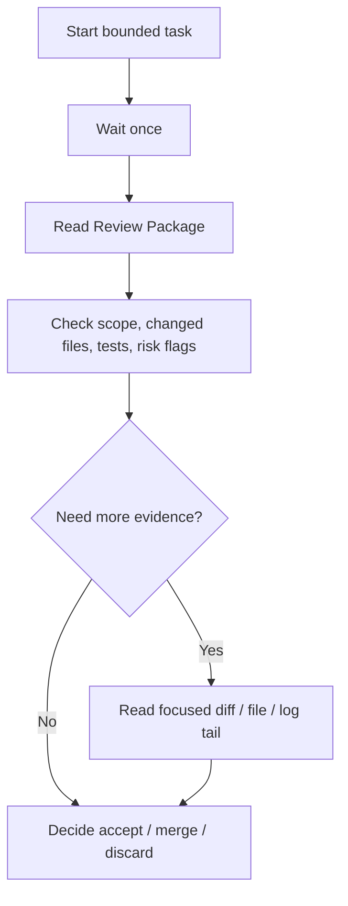

# AgentBridge Local

> Formerly **MiMo Bridge MCP**.

**AgentBridge Local is a local-first MCP orchestration console that lets Codex coordinate MiMo Code, Reasonix TUI, and future local coding agents without giving up review control.**

[](#current-status)
[](#quick-start)
[](#mcp-endpoint)
[](LICENSE)

Codex is good at planning, architecture, and review. Local coding agents are useful for long implementation loops. AgentBridge Local separates those jobs:

- **Codex plans and reviews.**
- **MiMo / Reasonix execute bounded tasks.**
- **Every task runs inside a Git Worktree.**
- **Codex reads a compact Review Package before touching diffs, logs, or files.**
- **You decide what gets merged.**

The goal is not "let an agent freely edit your repo." The goal is controlled delegation: small task scope, isolated execution, low-token review, and a human or Codex-controlled final decision.

## Why It Exists

Long coding loops can burn a lot of tokens and bury the important review signal. AgentBridge Local gives you a safer pattern:

1. Codex breaks work into a bounded task.
2. A local agent implements it in an isolated Worktree.
3. The daemon builds a small Review Package: changed files, diff stat, risk flags, scope report, test result, and log tail.
4. Codex reviews the package first.
5. Only risky or unclear tasks escalate to focused diff, focused file, or bounded log reads.
6. Codex or the user accepts, rejects, merges, discards, or asks the agent to continue.

That means Codex can stay in the expensive, high-leverage seat: planning, boundary control, review, and final acceptance.

## What You Get

- **Local MCP daemon** at `http://127.0.0.1:3210/mcp`.
- **Browser Admin UI** at `http://127.0.0.1:3210/`.
- **MiMo Code execution** through legacy `mimo_*` tools and the shared task queue.
- **Reasonix TUI execution** through generic `agent_*` tools.
- **Agent-aware task queue** that can run MiMo and Reasonix in parallel when their editable paths do not overlap.
- **Git Worktree isolation** for task changes.
- **Dynamic task scope** with per-task editable/read-only boundaries.
- **Low-token Review Package protocol** for Codex review.
- **Completion recovery inbox** so Codex can recover completed or failed tasks after interruption.
- **Model routing profiles** for simple, normal, complex, high-risk, and multimodal tasks.
- **Multimodal task attachments** with pasted images and uploaded files.
- **Safe local-open actions** for task folders, session folders, MiMo CMD sessions, Reasonix TUI CMD sessions, and Reasonix GUI companion viewing.
- **Windows portable ZIP and EXE installer** with bundled Node runtime.

## How It Works



## Current Status

AgentBridge Local is an **early alpha** project.

- Target OS: **Windows 10/11 x64**.
- Runtime: localhost-only Node daemon.
- MCP endpoint: `http://127.0.0.1:3210/mcp`.
- Admin UI: `http://127.0.0.1:3210/`.
- Distribution: portable ZIP and EXE installer with bundled Node.
- MiMo Code and Reasonix are not bundled; install and log in to those tools separately.
- Clean Windows validation and community testing are still welcome.

## Quick Start

### Option A: Use The Windows Installer

1. Download the latest release asset:
   - `MiMoBridgeSetup-win10-win11-x64.exe`
2. Run the installer.
3. Start AgentBridge Local from the installed launcher.
4. Open the Admin UI:

   ```text
   http://127.0.0.1:3210/
   ```

5. Point Codex MCP configuration to:

   ```text
   http://127.0.0.1:3210/mcp
   ```

### Option B: Run From Source

Prerequisites:

- Windows 10/11 x64.
- Git.
- Node.js 18+.
- Codex or another MCP-capable main agent.
- MiMo Code installed and logged in if you want MiMo execution.
- Reasonix installed and configured if you want Reasonix TUI execution.

From the repository root:

```powershell
npm.cmd install
npm.cmd run build
powershell -ExecutionPolicy Bypass -File apps/local-daemon/launcher.ps1 start -Open
```

Launcher controls:

```powershell
powershell -ExecutionPolicy Bypass -File apps/local-daemon/launcher.ps1 status
powershell -ExecutionPolicy Bypass -File apps/local-daemon/launcher.ps1 start -Open
powershell -ExecutionPolicy Bypass -File apps/local-daemon/launcher.ps1 stop
powershell -ExecutionPolicy Bypass -File apps/local-daemon/launcher.ps1 restart -Open
powershell -ExecutionPolicy Bypass -File apps/local-daemon/launcher.ps1 logs
```

## MCP Endpoint

Configure Codex to use:

```text
http://127.0.0.1:3210/mcp
```

Then ask Codex to start with a bounded task, for example:

```text
Use AgentBridge Local. Ask MiMo or Reasonix to update only docs/example.md.
Review the result through the Review Package first, then merge only if the scope and tests are clean.
```

## First Task Flow

1. Open the Admin UI.
2. Choose the workspace and task scope.
3. Select Auto routing or choose MiMo / Reasonix manually.
4. Paste the task objective. You can paste screenshots or upload files for multimodal tasks.
5. Let the agent run in a Worktree.
6. Review the compact result.
7. Accept, merge, discard, or ask the agent to continue.

## Low-Token Review Workflow

AgentBridge Local is built around bounded review, not full context dumps.



| Step | Default behavior | Token discipline |
| --- | --- | --- |
| Start | Send objective, workspace, editable paths, and routing profile. | Do not give the agent the whole machine. |
| Wait | Use one bounded wait or the recovery inbox. | Do not poll full status repeatedly. |
| Review | Read `detail_level="review"` first. | Do not read full source, full logs, or full diff by default. |
| Escalate | Read focused diff/file/log only when needed. | Ask for the smallest useful evidence. |
| Decide | Codex or the user merges/discards. | Execution agents do not merge themselves. |

## Supported Agents

| Agent | Status | Notes |
| --- | --- | --- |
| MiMo Code | Supported | Main Windows-first coding executor. Supports multimodal through MiMo flash routing. |
| Reasonix TUI | Supported | Runs through generic `agent_*` tools and shared Worktree/review flow. |
| Reasonix GUI | Companion only | Can be opened from the Admin UI, but direct deep-link to a specific session is not guaranteed. |
| Future agents | Planned | The generic Agent Registry is designed for more local runners. |

## Safety Model

AgentBridge Local intentionally keeps a narrow safety boundary:

- The daemon binds to localhost only.
- Tasks run in Git Worktrees.
- Machine-level `allowedRoots` limit which folders can be touched.
- Each task records its own editable/read-only scope snapshot.
- Out-of-scope changes appear in Review Package risk flags.
- Browser open actions are fixed actions, not arbitrary command execution.
- Full logs, full diffs, full files, and raw local paths are not default review output.
- MiMo and Reasonix should not merge their own task Worktrees.

Do not expose the daemon to a public network.

## Build, Test, And Package

Build:

```powershell
npm.cmd run build
npm.cmd --prefix apps/admin-ui run build
npm.cmd --prefix apps/local-daemon run build
```

Run normal regression, excluding the known hanging runner integration test:

```powershell
$tests = Get-ChildItem -LiteralPath 'tests' -Filter '*.test.mjs' |
  Where-Object { $_.Name -ne 'runner-integration.test.mjs' } |
  ForEach-Object { $_.FullName }
node --test $tests
```

Package:

```powershell
npm.cmd run package:portable
npm.cmd run package:installer
npm.cmd run validate:release
```

Generated release outputs:

- `artifacts/MiMoBridge-portable-win10-win11-x64.zip`
- `artifacts/MiMoBridgeSetup-win10-win11-x64.exe`
- `artifacts/release-validation.json`

The artifact names still use the original MiMoBridge naming for compatibility. The product name is now **AgentBridge Local**.

## Documentation

- [中文 README](README_zh-CN.md)
- [Troubleshooting](docs/TROUBLESHOOTING.md)
- [Good First Issues](docs/GOOD_FIRST_ISSUES.md)
- [GitHub Publication Checklist](docs/GITHUB_PUBLICATION_CHECKLIST.md)
- [Release Notes v0.1.0-alpha](docs/RELEASE_NOTES_v0.1.0-alpha.md)
- [Demo Script](docs/DEMO_SCRIPT.md)

Maintainer handoff docs:

1. `PROJECT_MEMORY.md` - long-term project memory and current release state.
2. `AGENTS.md` - agent rules, collaboration workflow, and commands.
3. `docs/HANDOVER_STATUS.md` - short current handover summary.
4. `docs/OPEN_TASKS.md` - pending work and risks.
5. `docs/RELEASE_VALIDATION.md` - clean Windows validation checklist.
6. `docs/modules/multi-agent-dispatch.md` - MiMo / Reasonix multi-agent design notes.

## Contributing

This project especially needs:

- Clean Windows 10/11 installer and portable ZIP validation.
- Codex MCP setup examples.
- MiMo and Reasonix task-flow testing.
- Admin UI screenshots and demo GIFs.
- Safer failure recovery reports.
- Documentation fixes for new users.
- New local agent adapters.

Start with [CONTRIBUTING.md](CONTRIBUTING.md), [docs/GOOD_FIRST_ISSUES.md](docs/GOOD_FIRST_ISSUES.md), and [SECURITY.md](SECURITY.md).

Please do not include API keys, tokens, MiMo credentials, Reasonix credentials, full private logs, local Worktrees, or unredacted personal paths in issues or pull requests.

## License

MIT. See [LICENSE](LICENSE).
