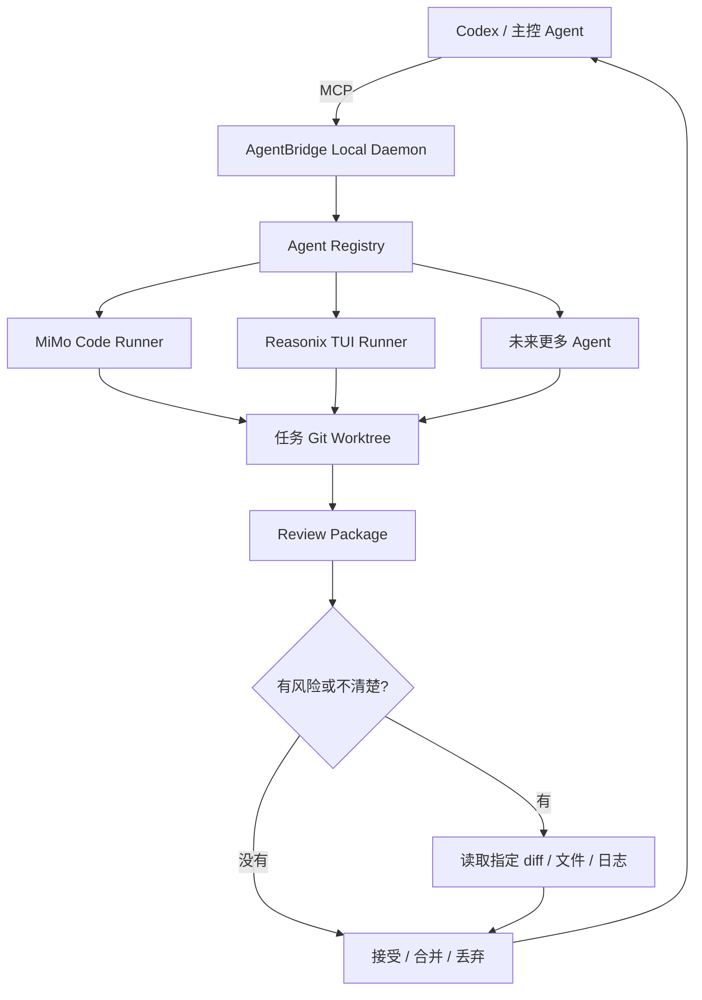

# AgentBridge Local

> 原名：**MiMo Bridge MCP**。

**AgentBridge Local 是一个本地优先的多 Agent 协作调度台。它让 Codex 通过 MCP 调度 MiMo Code、Reasonix TUI，以及未来更多本地编码 Agent。**

一句话解释：

> Codex 负责规划、拆任务、控制边界和审查；MiMo / Reasonix 负责在隔离的 Git Worktree 里执行具体修改；最后由 Codex 或用户决定是否合并。

它不是“让 Agent 随便改仓库”的工具，而是一个更可控的协作流程：明确任务边界、隔离执行、低 Token 审查、最终人工或 Codex 验收。

## 解决什么问题

Codex 很适合做：

- 需求拆解
- 架构判断
- 安全边界控制
- 代码审查
- 最终合并决策

但如果让 Codex 长时间直接写大量代码，会消耗很多输出 token，也容易让上下文变得臃肿。

AgentBridge Local 的思路是把“判断”和“执行”拆开：

1. Codex 生成一个边界清楚的任务。
2. MiMo 或 Reasonix 在独立 Worktree 里执行。
3. 系统生成一个小体积 Review Package。
4. Codex 先看摘要、风险、测试、变更文件。
5. 只有发现风险时，才读取指定 diff、文件或日志。
6. 最后由 Codex 或用户接受、合并、丢弃，或要求继续修改。

## 核心能力

- **本地 MCP 服务**：默认地址 `http://127.0.0.1:3210/mcp`。
- **管理后台**：默认地址 `http://127.0.0.1:3210/`。
- **MiMo Code 执行任务**：保留 `mimo_*` 兼容工具。
- **Reasonix TUI 执行任务**：通过通用 `agent_*` 工具接入。
- **多 Agent 队列**：MiMo 和 Reasonix 在修改范围不冲突时可以并行工作。
- **Git Worktree 隔离**：每个任务在独立 Worktree 中执行。
- **动态任务边界**：每个任务都会记录本次允许修改和只读参考范围。
- **低 Token 审查协议**：Codex 默认只读 Review Package，不读全仓、全日志、全 diff。
- **任务完成恢复机制**：Codex 中断后可以通过恢复 inbox 找回待审查任务。
- **模型路由**：支持简单、普通、复杂、高风险、多模态等场景配置。
- **多模态附件**：创建任务时可以粘贴图片或上传文件。
- **安全打开动作**：支持打开任务文件夹、会话文件夹、MiMo CMD 会话、Reasonix CMD 会话、Reasonix GUI。
- **Windows 安装包**：支持便携 ZIP 和 EXE 安装包，内置 Node 运行时。

## 工作流程



## 当前状态

项目目前是 **early alpha**。

- 优先支持：Windows 10/11 x64。
- 本地服务：只绑定 localhost。
- MCP 地址：`http://127.0.0.1:3210/mcp`。
- 管理后台：`http://127.0.0.1:3210/`。
- 分发方式：便携 ZIP 和 EXE 安装包。
- MiMo Code / Reasonix 需要用户自己安装并登录。
- 仍需要更多干净 Windows 环境测试和社区反馈。

## 快速开始

### 方式一：使用安装包

1. 下载 release 里的安装包：
   - `MiMoBridgeSetup-win10-win11-x64.exe`
2. 运行安装包。
3. 启动 AgentBridge Local。
4. 打开管理后台：

   ```text
   http://127.0.0.1:3210/
   ```

5. 在 Codex 的 MCP 配置里填入：

   ```text
   http://127.0.0.1:3210/mcp
   ```

### 方式二：从源码启动

前置条件：

- Windows 10/11 x64
- Git
- Node.js 18+
- Codex 或其他支持 MCP 的主控 Agent
- 如需 MiMo 执行任务：安装并登录 MiMo Code
- 如需 Reasonix 执行任务：安装并配置 Reasonix

在项目根目录运行：

```powershell
npm.cmd install
npm.cmd run build
powershell -ExecutionPolicy Bypass -File apps/local-daemon/launcher.ps1 start -Open
```

常用启动器命令：

```powershell
powershell -ExecutionPolicy Bypass -File apps/local-daemon/launcher.ps1 status
powershell -ExecutionPolicy Bypass -File apps/local-daemon/launcher.ps1 start -Open
powershell -ExecutionPolicy Bypass -File apps/local-daemon/launcher.ps1 stop
powershell -ExecutionPolicy Bypass -File apps/local-daemon/launcher.ps1 restart -Open
powershell -ExecutionPolicy Bypass -File apps/local-daemon/launcher.ps1 logs
```

## 第一个任务怎么跑

1. 打开管理后台。
2. 选择项目目录和本次允许修改的范围。
3. 选择 Auto 路由，或手动选择 MiMo / Reasonix。
4. 输入任务目标。可以粘贴截图，也可以上传文件。
5. 等 Agent 在 Worktree 中执行。
6. Codex 先查看 Review Package。
7. 如果没风险，接受或合并；如果有风险，只读取相关 diff、文件或日志。

## 低 Token 审查流程

默认流程不是“读完整仓库”，而是：

| 步骤 | 默认行为 | Token 策略 |
| --- | --- | --- |
| 创建任务 | 发送目标、工作区、可编辑路径和模型路由 | 不给 Agent 整台电脑权限 |
| 等待任务 | 等一次，或用恢复 inbox 找回完成任务 | 不反复读取完整状态 |
| 审查任务 | 先读 `detail_level="review"` | 不默认读全源码、全日志、全 diff |
| 需要更多证据 | 只读指定 diff、文件或日志尾部 | 只拿最小必要信息 |
| 最终决定 | Codex 或用户决定是否合并 | 执行 Agent 不自己合并 |

## 支持的 Agent

| Agent | 状态 | 说明 |
| --- | --- | --- |
| MiMo Code | 已支持 | 主要执行 Agent。MiMo flash 支持多模态。 |
| Reasonix TUI | 已支持 | 通过通用 `agent_*` 工具接入。 |
| Reasonix GUI | 辅助打开 | 可以从管理后台打开，但目前不能保证直达具体会话。 |
| 未来更多 Agent | 规划中 | Agent Registry 已为更多本地执行器预留结构。 |

## 安全边界

AgentBridge Local 的安全设计比较保守：

- daemon 只绑定 localhost。
- 每个任务使用 Git Worktree 隔离。
- 全局 `allowedRoots` 限制可操作目录。
- 每个任务保存自己的可编辑/只读范围快照。
- 越界修改会进入 Review Package 风险标记。
- 浏览器只能触发固定打开动作，不能传任意命令。
- 默认不返回完整日志、完整 diff、完整文件或本地原始路径。
- MiMo / Reasonix 不应该自己合并 Worktree。

不要把本地 daemon 暴露到公网。

## 构建与打包

```powershell
npm.cmd run build
npm.cmd --prefix apps/admin-ui run build
npm.cmd --prefix apps/local-daemon run build
```

普通回归测试需要排除一个已知会在 Windows 上挂起的集成测试：

```powershell
$tests = Get-ChildItem -LiteralPath 'tests' -Filter '*.test.mjs' |
  Where-Object { $_.Name -ne 'runner-integration.test.mjs' } |
  ForEach-Object { $_.FullName }
node --test $tests
```

打包：

```powershell
npm.cmd run package:portable
npm.cmd run package:installer
npm.cmd run validate:release
```

生成产物：

- `artifacts/MiMoBridge-portable-win10-win11-x64.zip`
- `artifacts/MiMoBridgeSetup-win10-win11-x64.exe`
- `artifacts/release-validation.json`

注意：产物文件名目前仍保留 MiMoBridge，这是为了兼容旧安装和配置；项目展示名已经改为 **AgentBridge Local**。

## 如何贡献

欢迎从这些方向开始：

- 在干净 Windows 10/11 上测试安装包和便携包。
- 补充 Codex MCP 配置示例。
- 测试 MiMo / Reasonix 真实任务流程。
- 补充管理后台截图或 demo GIF。
- 改进故障排查文档。
- 增加新的本地 Agent 适配器。
- 优化 Admin UI。

开始前建议阅读：

- [CONTRIBUTING.md](CONTRIBUTING.md)
- [SECURITY.md](SECURITY.md)
- [docs/GOOD_FIRST_ISSUES.md](docs/GOOD_FIRST_ISSUES.md)
- [docs/TROUBLESHOOTING.md](docs/TROUBLESHOOTING.md)

请不要在 Issue 或 PR 里上传 API Key、token、MiMo/Reasonix 凭据、完整私有日志、本地 Worktree、未打码的个人路径。

## License

MIT. See [LICENSE](LICENSE).
