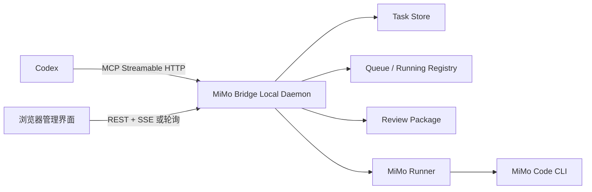

# P5 管理界面开发文档

**文档日期：2026年6月20日**
**代码基线：`c909016`；P4 修复工作区尚未提交**
**状态：P5 管理界面和 P5.1 安全任务删除已实现并完成复核**

## 一、结论与分工

管理界面可以交给第三方 Agent 开发，但必须拆分职责：

| 角色 | 负责内容 |
|------|----------|
| 第三方 Agent | 页面设计、前端实现、本地管理 API 适配层、前端测试 |
| Codex | 协议边界、架构审查、安全审查、最终验收 |
| MiMo Code | MCP 后端补口、低成本代码执行、按审查意见修复 |

第三方不得自行修改任务存储、Runner、Worktree、Review Package 或队列语义。确需修改 MCP 工具字段时，先提交接口变更说明，由 Codex 审核后再实施。

## 二、项目目标

为非专业开发者提供一个仅在本机运行的管理界面，用于：

- 创建和查看 MiMo 编码任务。
- 查看运行、排队、等待、审查和完成状态。
- 基于 Review Package 进行低成本审查。
- 有风险时按文件读取 diff、日志或文件内容。
- 回复、取消、验收、放弃、合并或丢弃任务修改。
- 查看队列和 Token 预算状态。

第一版重点是功能清楚、操作安全、错误信息可理解，不追求复杂动画和多用户能力。

## 三、关键架构约束

生产协作使用共享本地 daemon 的 Streamable HTTP MCP；`stdio` 仅保留兼容和测试用途。队列、运行任务注册表和 Token 预算仍由同一个 daemon 进程共享。

推荐将第一版运行形态调整为一个本地守护进程：



守护进程必须：

- 只监听 `127.0.0.1`，默认禁止局域网和公网访问。
- 让 Codex 和界面共享同一套 TaskStore、Queue、Running Registry 和 TokenBudgetManager 实例。
- 同时提供 MCP 入口和管理界面 API。
- 保留现有 `stdio` 入口用于测试或兼容，但生产使用时不能同时启动两个独立任务执行进程。
- 不向浏览器暴露 `MIMO_NODE_PATH`、`MIMO_ENTRY_PATH`、原始日志绝对路径或其他本机敏感信息。

禁止方案：由界面后端单独 `spawn dist/index.js`，同时让 Codex继续连接另一份 `stdio` 服务。

## 四、建议技术方案

为减少与现有 Node.js + TypeScript 项目的技术差异，建议：

- 前端：React + TypeScript + Vite。
- 本地管理层：Node.js + TypeScript。
- 状态请求：第一版使用 2-3 秒轮询；稳定后可升级为 SSE。
- 样式：轻量 CSS 方案即可，不强制引入大型 UI 框架。
- 测试：Node Test 保留后端测试；前端使用 Vitest + Testing Library；关键流程使用 Playwright。

建议目录：

```text
apps/
  admin-ui/       # React 管理界面
  local-daemon/   # 共享 MCP 与管理 API 的本地守护进程
```

如果第三方希望采用其他前端框架，必须保持下述接口和安全边界不变。

## 五、页面结构

### 5.1 全局布局

- 左侧导航：总览、任务、队列、Token、系统状态。
- 顶部栏：服务连接状态、当前运行任务数、刷新按钮。
- 主区域：当前页面内容。
- 所有危险操作使用确认对话框，不使用仅靠颜色区分的状态。

### 5.2 总览页

显示：

- 运行中、排队中、待审查、失败任务数量。
- 当前运行任务和队列前几项。
- 最近任务列表。
- Token 使用率和警告；数据未接通时明确显示“统计尚未接入”，不得显示伪造的 0 消耗。
- P4 队列风险提示。

### 5.3 任务列表页

每行显示：

- `task_id`
- 状态
- MiMo 摘要
- 风险数量
- 最近更新时间
- 可执行操作

支持状态筛选和手动刷新。第一版不做全文搜索和服务端分页。

### 5.4 新建任务页

字段与 `mimo_start_task` 一致：

| 字段 | 规则 |
|------|------|
| `objective` | 必填 |
| `workspace_path` | 必填，Windows 绝对路径 |
| `editable_paths` | 可编辑路径列表 |
| `readonly_paths` | 只读路径列表 |
| `acceptance_criteria` | 验收标准列表 |
| `max_rounds` | 1-10，默认 5 |
| `runtime_timeout_seconds` | 60-3600，默认 900 |
| `use_worktree` | 默认关闭；Git 项目建议开启 |
| `priority` | 0-10，默认 5 |

P4 修复后，已有写任务运行时仍可提交新任务或回复；daemon 会返回 `queued` 并在当前 Runner 结束后串行执行。

### 5.5 任务详情页

顶部显示任务状态、任务 ID、当前轮次和主要操作。

默认只请求：

```json
{
  "task_id": "task_xxx",
  "detail_level": "review",
  "max_chars": 8000
}
```

页面区域：

1. Review Package：目标、修改文件数、diff stat、测试结果、风险和建议。
2. 修改文件：从 `changed_files` 展示，点击后才请求该文件的 focused diff 或内容。
3. 日志：默认不加载；用户点击后请求最近 20 行。
4. 回复区：仅在允许回复的状态显示。
5. 验收区：合并、丢弃、验收、放弃。
6. 调试区：`full` 模式隐藏在高级选项中，必须二次确认。

### 5.6 队列页

显示 `running`、`queued` 和队列项。返回 `queued` 表示任务尚未启动，正在等待当前 Runner 结束。

### 5.7 Token 页

显示输入、输出、总 Token、预估成本、剩余额度和警告。

当前限制：`TokenBudgetManager.recordUsage()` 尚未接入 MiMo 事件或 MCP 返回链路，生产数据通常会一直为零。第三方只能完成界面和空状态；真实统计接入应作为单独后端任务。

“重置预算”调用 `mimo_token_status({ reset: true })`，必须弹出确认框。

## 六、状态与操作规则

| 任务状态 | 允许操作 |
|----------|----------|
| `queued` | 查看、取消 |
| `running` | 查看摘要、取消 |
| `waiting` | 查看、回复、取消 |
| `review` | 审查、回复、合并/丢弃、验收/放弃 |
| `accepted` | 查看；存在 Worktree 时可合并 |
| `failed` | 查看 Review Package、日志和失败原因 |
| `cancelled` | 查看；无 Worktree 时可永久删除 |
| `abandoned` | 查看；无 Worktree 时可永久删除 |

`accepted` 和 `failed` 任务也可在没有 Worktree 时永久删除。删除会同步清理任务记录、brief 和日志，且不可恢复。

推荐成功流程：

1. 读取 Review Package。
2. 无风险时先执行 Worktree `merge`。
3. 合并成功后执行 `mimo_finish_task(status="accepted")`。

推荐放弃流程：

1. 有 Worktree 时先执行 `discard`。
2. 丢弃成功后执行 `mimo_finish_task(status="abandoned")`。

如果需要 MiMo 修改，不要标记完成，调用 `mimo_reply_task` 并说明具体问题。

## 七、现有 MCP 工具映射

当前基线注册 10 个工具：

| 界面动作 | MCP 工具 | 主要参数 |
|----------|----------|----------|
| 新建任务 | `mimo_start_task` | 新建任务表单字段 |
| 查询详情 | `mimo_get_task` | `task_id`、`detail_level`、预算及路径 |
| 继续修改 | `mimo_reply_task` | `task_id`、`message`、`priority` |
| 取消任务 | `mimo_cancel_task` | `task_id` |
| 验收/放弃 | `mimo_finish_task` | `task_id`、`accepted/abandoned` |
| 最近任务 | `mimo_list_tasks` | `limit`，范围 1-50 |
| 合并/丢弃 | `mimo_merge_task` | `task_id`、`merge/discard` |
| 队列状态 | `mimo_queue_status` | 无 |
| Token 状态 | `mimo_token_status` | `reset`，默认 false |
| 永久删除任务 | `mimo_delete_task` | `task_id`；仅限已结束且无 Worktree |

所有 MCP 返回值都是 JSON 文本。管理 API 层负责解析，并统一包装为：

```ts
type ApiResult<T> =
  | { ok: true; data: T }
  | { ok: false; error: string; details?: unknown };
```

前端不得直接解析 MCP `content` 数组。

## 八、建议管理 API

本地守护进程向界面提供：

| 方法 | 路径 | 映射 |
|------|------|------|
| `GET` | `/api/health` | 守护进程、MiMo 和 MCP 状态 |
| `GET` | `/api/tasks?limit=20` | `mimo_list_tasks` |
| `POST` | `/api/tasks` | `mimo_start_task` |
| `GET` | `/api/tasks/:id` | `mimo_get_task`，默认 review |
| `POST` | `/api/tasks/:id/replies` | `mimo_reply_task` |
| `POST` | `/api/tasks/:id/cancel` | `mimo_cancel_task` |
| `POST` | `/api/tasks/:id/finish` | `mimo_finish_task` |
| `POST` | `/api/tasks/:id/worktree` | `mimo_merge_task` |
| `DELETE` | `/api/tasks/:id` | `mimo_delete_task` |
| `GET` | `/api/queue` | `mimo_queue_status` |
| `GET` | `/api/token-budget` | `mimo_token_status(reset=false)` |
| `POST` | `/api/token-budget/reset` | `mimo_token_status(reset=true)` |

API 必须校验参数，不能把任意工具名和任意参数透传给浏览器。

## 九、低上下文审查界面规则

- 打开任务详情时只请求 `review`，不预加载 diff、日志和文件。
- 先展示 `editable_paths`、`changed_files`、越界报告、diff stat、测试结果和风险标记。
- 只有用户点击具体文件时，才请求对应 `diff_paths` 或 `file_paths`。
- 日志只请求最近 N 行，默认 20，最大 200。
- `max_chars` 默认 8000，普通界面不允许超过 20000。
- `full` 只用于调试，必须显示预算和确认提示。
- `review_recommendation` 仅作提示，禁止自动合并。

风险显示建议：

| Risk Flag | 界面级别 |
|-----------|----------|
| `OUT_OF_BOUNDS_CHANGES` | 阻塞，红色 |
| `TESTS_FAILED` | 阻塞，红色 |
| `TASK_FAILED` / `NON_ZERO_EXIT` | 阻塞，红色 |
| `REVIEW_DATA_UNAVAILABLE` | 需要人工检查，橙色 |
| `TASK_ERROR` / `ISSUES_REPORTED` | 需要关注，橙色 |

## 十、当前接口缺口

以下内容不能由前端猜测，需要后端补充或界面降级处理：

1. `mimo_list_tasks` 缺少 `created_at`、`updated_at`、`objective`、风险数量和 Worktree 状态。
2. `review` 响应缺少 `has_worktree`、`available_actions` 等界面动作提示。
3. Token 预算未接入真实 MiMo token 事件，当前数值不能作为真实成本依据。
4. 没有事件推送；第一版只能轮询。
5. P4 队列已通过行为审核；界面允许提交后续写任务并展示排队状态。
6. `mimo_merge_task` 不会自动把任务状态更新为 `accepted/abandoned`，界面需要按顺序调用两个动作并处理部分失败。
7. 永久删除没有撤销接口；前端必须保持二次确认，后端必须继续校验终态和 Worktree。

这些缺口应记录为后端任务，未经审核不要直接修改现有 MCP 返回结构。

## 十一、第三方修改边界

允许直接修改：

- `apps/admin-ui/**`
- `apps/local-daemon/**`
- 对应测试文件
- 本文档中的实现状态和接口说明

需要先申请审核：

- `src/index.ts`
- `src/tools/**`
- `src/services/**`
- `src/types.ts`
- MCP 工具名称、参数、状态机和 Review Package 字段

绝对禁止：

- 浏览器直接读取 `runtime/tasks`、原始日志或 Worktree 文件。
- 默认返回或预加载完整仓库、完整 diff、完整日志。
- 监听 `0.0.0.0` 或把本机路径暴露给远程用户。
- 绕过 MCP 路径校验直接读取任意文件。
- 自动执行 `merge`、`discard`、`accepted`、`abandoned` 或 Token reset。
- 为了界面方便而复制一套独立 TaskStore、Queue 或 TokenBudgetManager。

## 十二、开发阶段

### UI-0：静态原型

- 使用假数据完成总览、任务列表、新建任务和任务详情。
- 由用户确认布局和操作名称。
- 不修改 MCP 后端。

### UI-1：共享本地守护进程

- 建立同进程 MCP 与管理 API。
- 完成 health、任务列表、任务详情和队列接口。
- 确认 Codex 与界面看到同一运行状态。

### UI-2：任务操作

- 接入新建、回复、取消、验收、放弃、合并和丢弃。
- 加入状态限制、确认框和错误恢复。

### UI-3：低成本审查

- 接入 Review Package、focused diff、日志尾部和风险提示。
- 验证初次打开详情不会读取完整 diff 或日志。

### UI-4：Token 与体验完善

- 后端完成真实 token 计量后再显示正式统计。
- 补齐空状态、加载状态、断线重连和可访问性。

## 十三、验收标准

功能验收：

- 能创建、查看、回复、取消和完成任务。
- 能显示队列，并将后续写操作安全提交为 queued。
- 默认详情只请求 Review Package。
- 只能按选定文件读取 focused 内容。
- 合并、丢弃、放弃、重置预算均有确认。
- MCP 断开后界面显示明确错误，不伪造成功状态。

安全与预算验收：

- 服务只监听 localhost。
- 初次打开任务详情不包含完整 diff、完整日志或完整文件。
- 前端不能传入任意工具名。
- 路径穿越和非白名单文件请求被拒绝。
- 不显示原始日志绝对路径和环境变量。

测试验收：

- 前端组件测试覆盖状态、风险和操作权限。
- 管理 API 使用模拟 MCP 覆盖 10 个工具映射。
- E2E 覆盖新建任务、review 审查、按文件升级、回复、取消和合并确认。
- 保持现有 `npm.cmd run build` 通过。
- 后端变更后运行 `AGENTS.md` 记录的正常回归，并继续明确排除已知挂起的 `runner-integration.test.mjs`。

## 十四、第三方交付物

第三方完成后必须提供：

1. 可运行的前端和本地守护进程源码。
2. 一条明确的开发启动命令和一条生产构建命令。
3. 界面截图或短录屏。
4. MCP/API 映射测试结果。
5. 修改文件清单。
6. 未完成项和已知风险。
7. Review Package，供 Codex 按低上下文协议验收。

## 十五、给第三方 Agent 的开工指令

> 按 `docs/UI_DEVELOPMENT.md` 开发 P5 管理界面。先完成 UI-0 静态原型，不修改 MCP 核心。原型确认后再实现共享本地守护进程。禁止启动与 Codex 分离的第二套任务执行 MCP，禁止直接读取 runtime、日志或 Worktree，禁止默认加载完整 diff/日志/文件。任何 `src/tools`、`src/services`、`src/types.ts` 或 MCP schema 修改必须先列出原因和最小接口变更，等待审核。每个阶段提交修改清单、测试结果和 Review Package。

## 十六、当前实现状态（2026-06-20 更新）

本节记录当前仓库内已经落地的管理界面实现，供后续验收、交接和继续开发使用。

### 16.1 已实现范围

当前已按用户确认的 B+C 融合方案完成可运行版本：

- B：面向非专业开发者的友好引导流程。
- C：任务详情页采用 review-first 工作台。

前端目录：

`apps/admin-ui`

本地守护进程目录：

`apps/local-daemon`

当前页面模块共 7 个：

1. 总览页。
2. 任务列表页。
3. 新建任务页。
4. 任务详情 / Review 工作台。
5. 队列页。
6. Token 页。
7. 系统状态页。

### 16.2 前端已接入能力

前端已从静态原型推进为可实际操作的本地管理台，已接入固定 REST API：

- `GET /api/health`
- `GET /api/tasks?limit=20`
- `POST /api/tasks`
- `GET /api/tasks/:id?detail_level=review&max_chars=8000`
- `POST /api/tasks/:id/replies`
- `POST /api/tasks/:id/cancel`
- `POST /api/tasks/:id/finish`
- `POST /api/tasks/:id/worktree`
- `DELETE /api/tasks/:id`
- `GET /api/queue`
- `GET /api/token-budget`
- `POST /api/token-budget/reset`

已实现的用户操作：

- 创建任务。
- 发送回复。
- 取消任务。
- 验收任务。
- 放弃任务。
- 合并 Worktree 后验收。
- 丢弃 Worktree 后放弃。
- 重置 Token 预算。
- 永久删除已结束且没有 Worktree 的任务。

所有危险操作均保留二次确认；操作成功或失败会显示明确通知。

### 16.3 低上下文审查实现

任务详情页已按低上下文协议实现：

- 初次打开任务详情只请求 `detail_level=review`。
- 默认不加载完整 diff。
- 默认不加载完整日志。
- 默认不加载完整文件内容。
- 用户点击“加载选中文件”后才请求 focused/diff 内容。
- 用户点击“加载最近 20 行”后才请求日志尾部。
- `full` 模式隐藏在高级调试区，需二次确认，且前端请求上限为 `max_chars=20000`。

### 16.4 守护进程实现

本地守护进程：

- 只监听 `127.0.0.1`。
- 默认端口 `3210`。
- 同时提供 MCP Streamable HTTP 入口 `/mcp` 和管理 API `/api/*`。
- 静态服务已构建的 `apps/admin-ui/dist`。
- REST API 与 MCP endpoint 复用同一个进程内 `TaskStore`、队列/运行注册表和 Token handler。
- 不提供任意 MCP 工具代理。

daemon 层已为 UI 安全补充列表字段：

- `objective`
- `created_at`
- `updated_at`
- `current_round`
- `has_worktree`

这些字段来自同一个 `TaskStore`，没有修改 MCP 核心 schema。

### 16.5 浏览器安全与脱敏

管理 API 返回给浏览器前会递归脱敏以下字段：

- `raw_log_path`
- `stderr_log_path`
- `worktree_path`
- `workspace_path`
- `repo_path`
- `worktrees_root`
- `mimoNodePath`
- `mimoEntryPath`

浏览器仍然禁止：

- 直接读取 `runtime/tasks`。
- 直接读取原始日志。
- 直接读取 Worktree 文件。
- 传入任意 MCP 工具名让 daemon 代理执行。

### 16.6 P4 队列状态

P4 已通过 Runner 调用次数行为测试：

- UI 不再因存在 running 任务而禁用“开始任务”和“发送回复”。
- 后续写任务由 daemon 返回 queued 并实际等待当前 Runner 完成、失败或取消。
- 队列页展示实际串行状态，不再显示旧的提前启动警告。

### 16.7 Token 状态说明

Token 页面已接入 `/api/token-budget` 和 `/api/token-budget/reset`。

当前限制仍然存在：

- `TokenBudgetManager.recordUsage()` 尚未完整接入真实 MiMo token 事件链路。
- 因此 UI 不把 0 展示为真实成本为 0，只显示“API 已连接；真实事件可能未接入”。

### 16.8 当前启动方式

一键启动：

```powershell
cd "C:\Users\86172\Desktop\MiMo Code project\Agent 协作项目\mimo-bridge-mcp\apps\local-daemon"
powershell -ExecutionPolicy Bypass -File .\start-local.ps1
```

打开：

`http://127.0.0.1:3210/`

已修复 `start-local.ps1` 中 Windows 路径带空格时入口脚本传参失败的问题。

### 16.9 验证结果

最近一次验证结果：

- `apps/admin-ui` 构建通过。
- `apps/local-daemon` 构建通过。
- 根项目 `npm.cmd run build` 通过。
- 新增 `tests/admin-api.test.mjs` 通过。
- `tests/stdio-protocol.test.mjs` 已更新为当前 10 个 MCP 工具。
- 新增 Codex 交接行为测试 3 项并通过。
- 删除 API 已覆盖成功清理、活动任务拒绝和 Worktree 拒绝。
- 正常回归通过：175 passed，0 failed。
- 正常回归仍按 `AGENTS.md` 排除已知挂起的 `runner-integration.test.mjs`。

浏览器 smoke 验证通过：

- 页面可打开。
- 页面标题为“MiMo 管理台”。
- API ready 状态可见。
- 任务列表可见。
- 任务详情可进入 Review 工作台。
- 低上下文文案存在。
- Token reset 确认弹窗可打开并取消。
- cancelled 任务显示删除按钮；永久删除确认框可打开并取消。
- 3 个旧任务已通过固定删除 API 清理，界面刷新后显示空任务状态。
- 浏览器控制台无相关 warning/error。

### 16.10 当前已知未完成项

当前 UI 功能已基本完成。剩余项主要是后端真实数据增强或后续质量工作：

- 真实 MiMo token 事件统计仍需后端链路接入。
- 若要进一步完善任务列表数据，可在后端正式 schema 中补充更多安全字段，但需先走接口变更审核。
- 可继续补更完整的前端组件测试和端到端测试；目前已有管理 API 映射测试和浏览器 smoke 验证。

### 16.11 Codex 协同交接（2026-06-20）

任务详情操作区已新增“交给 Codex 审查”：

- 生成包含 `task_id`、任务目标、当前状态和低上下文审查顺序的交接指令。
- 优先复制交接指令到剪贴板。
- 使用已验证支持的 `codex://threads/new` 打开 Codex 新会话。
- 不使用未经验证的 URL 参数自动注入或自动发送消息；用户需要在 Codex 中粘贴并发送。
- 剪贴板失败时在页面显示完整指令，允许手动复制。
- 指令明确复杂或高风险部分可由 Codex 直接执行，不要求所有工作退回 MiMo。

Codex 全局配置已从独立 STDIO 进程切换为：

```toml
[mcp_servers.mimo_bridge]
url = "http://127.0.0.1:3210/mcp"
```

原配置备份：

`C:\Users\86172\.codex\config.toml.mimo-bridge-stdio-backup-2026-06-20`

`codex mcp get mimo_bridge --json` 已确认 transport 为 `streamable_http`；守护进程 health 为 ready。配置需要重启 Codex 或新建 Codex 会话后生效。
